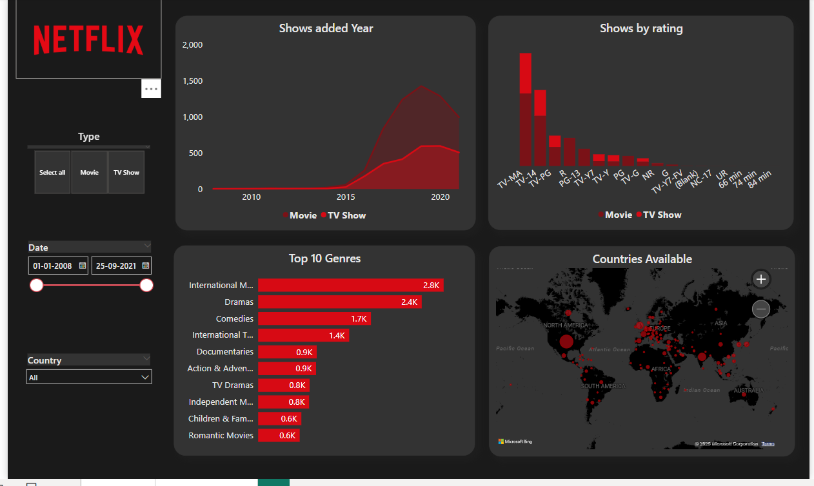
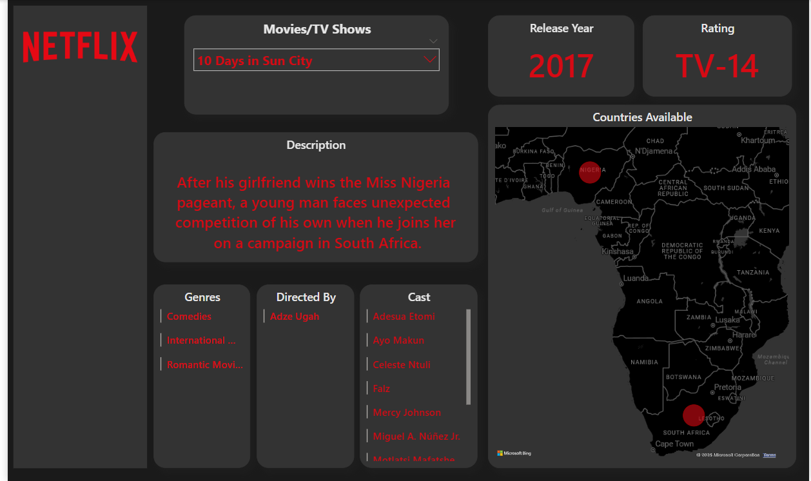

# SQL-Excel-Power-BI---Netflix-Data-Analysis
This project explores and visualizes Netflix's catalog using a combination of Excel, SQL, and Power BI. The dashboard provides insights into show distribution by year, genre, ratings, and country availability, helping users understand Netflix’s content landscape more deeply.

---

## 📸 Dashboard Screenshots

### 🎬 Movie/TV Show Detail Page

### 🌐 Global Insights Page

## 📁 Dataset Overview

The dataset contains information on Netflix Movies and TV Shows with the following key columns:

- **Title**
- **Cast**
- **Director**
- **Country**
- **Date Added**
- **Release Year**
- **Rating**
- **Duration**
- **Genres (Listed_in)**
- **Type** (Movie / TV Show)

---

## 🧹 Data Cleaning (Excel)

Data preprocessing was performed in **Microsoft Excel**:

- Used **Text to Columns** to split fields containing multiple values (e.g., `cast`, `director`, `listed_in`, `country`) into separate rows.
- Saved cleaned and normalized data into multiple CSV files:
  - `titles.csv`
  - `cast.csv`
  - `director.csv`
  - `listed_in.csv`
  - `country.csv`

---

## 🧱 Data Transformation (SQL)

Performed data pivoting using SQL:

- Converted multi-value fields into normalized formats (row-wise).
- Created joinable datasets with primary keys from `titles.csv` to build relationships with associated dimensions:
  - One-to-many and many-to-many relationships were established between `titles` and other entities like `cast`, `genres`, `country`.

---

## 🧰 Data Modeling (Power BI)

Used **Power Query Editor** to:

- Import and clean the SQL-transformed CSVs.
- Define relationships between:
  - `titles` ↔ `cast`
  - `titles` ↔ `director`
  - `titles` ↔ `listed_in` (genres)
  - `titles` ↔ `country`
- Created a **star schema** for optimal performance and visualization.

---

## 📊 Dashboard Features

### 🧾 Page 1: Movie/TV Show Detail View

- Dropdown filter to select a title.
- Displays:
  - Title description
  - Release year
  - Rating
  - Genres
  - Cast & Director
  - Country availability
- Interactive **map** showing countries where a selected title is available.

#### 🔍 Example:
**"10 Days in Sun City"**
- Released: 2017
- Rating: TV-14
- Available in: Nigeria, South Africa
- Directed by: Adze Ugah
- Stars: Adesua Etomi, Ayo Makun, Falz, Mercy Johnson

---

### 🌍 Page 2: Global Insights

- **Shows Added Over Time** (2008–2021)
- **Content by Rating** (TV-MA, TV-14, PG, etc.)
- **Top 10 Genres** (e.g., International Movies, Dramas, Comedies)
- **Map of Country Availability** (Global view)

---

## 📈 Key Insights

1. **Content Boom (2016–2019):**
   - Massive growth in Netflix content, especially movies, peaking around 2019.

2. **Rating Distribution:**
   - Most content falls under **TV-MA** and **TV-14**, targeting adult and young adult audiences.
   - Low share of content for children and family audiences.

3. **Genre Popularity:**
   - Top genres: **International Movies**, **Dramas**, **Comedies**
   - Reflects global expansion and demand for localized content.

4. **Geographic Reach:**
   - Netflix content is widely available in **North America, Europe, India, South Africa**, and **Nigeria**.
   - Some countries have limited or no content representation.

5. **Regional Representation:**
   - African movies like "10 Days in Sun City" show strategic collaborations between countries (Nigeria & South Africa).

---

## 💡 Recommendations

1. **Expand Family & Kids Programming**
   - Diversify rating offerings by increasing PG and G-rated content to attract family viewers.

2. **Double Down on International Content**
   - Continue investing in region-specific productions, subtitles, and dubbing.

3. **Genre Balance**
   - Promote underrepresented genres like Documentaries, Independent Films, and TV Dramas.

4. **Global Market Penetration**
   - Target content rollouts in countries with low Netflix footprint to increase global engagement.

5. **Leverage Local Stars**
   - Utilize well-known regional actors to scale local content globally (e.g., Nollywood to African diaspora).

6. **Content Pace Monitoring**
   - Analyze why content additions dropped post-2019 and strategize future content releases.

---

